:toc:
:toclevels: 3
:sectnums:
:sectnumlevels: 3

= Vue.js基础入门

== 模版语法

=== 简介

相信模板语法大家多少都有所接触，例如百度模板引擎、ejs 等等。同样 Vue.js 也使用了基于 HTML 的模板语法，允许开发者声明式地将 DOM 绑定至底层 Vue 实例的数据。所有 Vue.js 的模板都是合法的 HTML ，所以能被遵循规范的浏览器和 HTML 解析器解析，通俗的讲 Vue 模板语法就是在使用 Vue.js 开发时，你可以写在 HTML 元素上的操作语法，让你开发更高效，例如：绑定样式，循环出元素列表等。

==== 双大括号表达式

在前端的发展历程中，为了提高开发效率，诞生了很多模板引擎，方便渲染元素或者绑定数据，很多引擎模板都采用 {{双大括号表达式}} 的语法进行插值。同样 Vue.js 也借鉴了 Angular.js 的双花括号的方式，进行向页面输出数据和调用对象方法。让我们感受一下双大括号表达式，在 IED 中新建一个.html 后缀文件，引入 Vue.js，输入以下代码，运行（open with Preview 或 Mini Browser）

[source,html,indent=0]
----
<!DOCTYPE html>
<html lang="en">
  <head>
    <meta charset="UTF-8" />
    <meta name="viewport" content="width=device-width, initial-scale=1.0" />
    <meta http-equiv="X-UA-Compatible" content="ie=edge" />
    <title>syl-vue</title>
    <!-- 通过cdn方式引入 vue.js -->
    
  </head>
  <body>
    <!-- 数据双向绑定 -->
    

      <input type="text" v-model="msg" />
      
{{msg}}

    

    
  </body>
</html>
----

双大括号中的 {{msg}}，绑定至底层 Vue 实例的数据，在浏览器中就被渲染成实例 data 选项中 msg 的值。

运行结果：

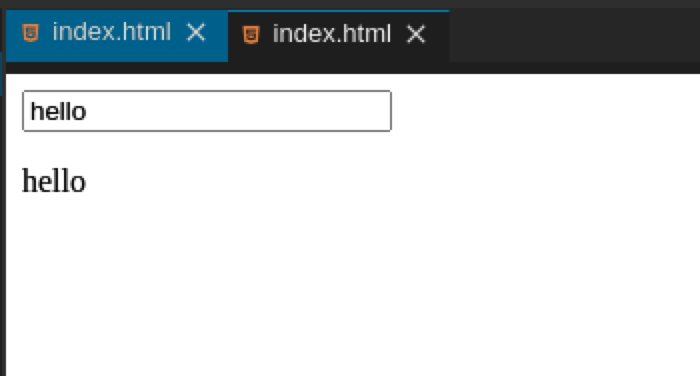

==== 插值

上面初步了解了双大括号语法，接下来我们学习一下更多的插值方式。

===== 文本

在 Vue.js 中数据绑定最常见的形式就是使用“Mustache”语法 (双大括号) 的文本插值：

[source,html,indent=0]
----

msg：{{msg}}

----

双大括号中的值将会被替代为对应 `data` 对象上 `msg` 属性的值。无论何时，绑定的数据对象上 `msg` 属性发生了改变，插值处的内容都会更新。

但是通过使用 `v-once` 指令你也能执行一次性地插值，当数据**改变时**，插值处的内容**不会更新**。但是你需要注意一下，该元素节点下面其他数据的绑定，数据改变，内容也不会更新，所以，注意代码块的划分。

[source,html,indent=0]
----

msg：{{msg}}

----

===== 原始html

上面的双大括号表达式会将数据解释为普通文本，即使你的数据为 HTML 元素，也不会渲染成对应的标签元素，只能渲染成普通文本，而非 HTML 代码，例子：

[source,html,indent=0]
----
<!DOCTYPE html>
<html lang="en">
  <head>
    <meta charset="UTF-8" />
    <meta name="viewport" content="width=device-width, initial-scale=1.0" />
    <meta http-equiv="X-UA-Compatible" content="ie=edge" />
    <title>syl-vue</title>
    <!-- 通过cdn方式引入 vue.js -->
    
  </head>
  <body>
    <!-- 数据绑定 -->
    

      
{{msg}}

    

    
  </body>
</html>
----

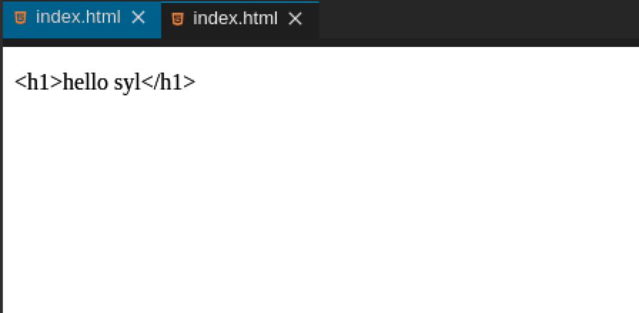

上面明明我们写的是 HTML 标签，为什么没渲染出来，那就是因为双大括号表达式会将数据解释为普通文本。有的同学会问，有的需求就是要把标签渲染出来，那么我们就需要认识另外一个指令 v-html，使用它我们就能将它正确渲染，试一试，代码：

[source,html,indent=0]
----
<!DOCTYPE html>
<html lang="en">
  <head>
    <meta charset="UTF-8" />
    <meta name="viewport" content="width=device-width, initial-scale=1.0" />
    <meta http-equiv="X-UA-Compatible" content="ie=edge" />
    <title>syl-vue</title>
    <!-- 通过cdn方式引入 vue.js -->
    
  </head>
  <body>
    <!-- v-html 渲染html元素-->
    

    
  </body>
</html>
----

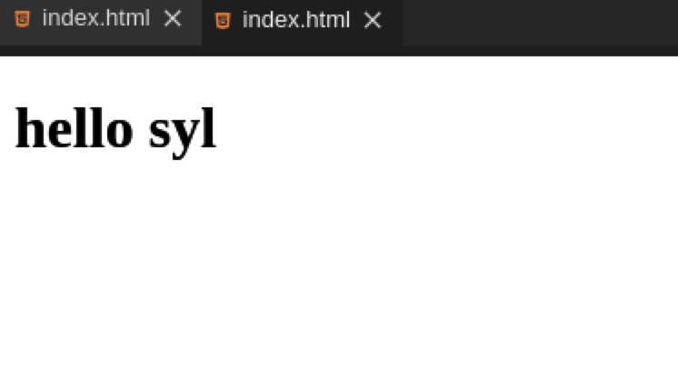

===== 特性

双大括号语法不能作用在 HTML 特性（标签属性）上，需要对标签属性操作，应该使用 v-bind 指令：

[source,html,indent=0]
----

----

HTML 标签属性为布尔特性时，它们的存在表示为 true，v-bind 工作起来略有不同，在这个例子中：

[source,html,indent=0]
----
<!DOCTYPE html>
<html lang="en">
  <head>
    <meta charset="UTF-8" />
    <meta name="viewport" content="width=device-width, initial-scale=1.0" />
    <meta http-equiv="X-UA-Compatible" content="ie=edge" />
    <title>syl-vue</title>
    <!-- 通过cdn方式引入 vue.js -->
    
  </head>
  <body>
    <!-- 布尔特性绑定-->
    

      <input type="checkbox" v-bind:checked="isChecked" />
    

    
  </body>
</html>
----

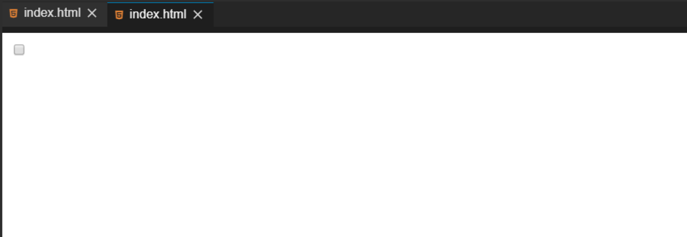

NOTE: 如果 isChecked 的值是 null、undefined 或 false，则 checked 特性甚至不会被包含在渲染出来的 <input> 元素中，我们将 data 中的 isChecked 值改为 null

[source,javascript,indent=0]
----
var app = new Vue({
  el: '#app',
  data: {
    isChecked: null, // isChecked是否选中boolean
  },
});
----

===== JavaScript表达式

上面，我们只进行了绑定简单的属性键值。但实际上，对于所有的数据绑定，Vue.js 都提供了完全的 JavaScript 表达式支持，感受强大的模板语法力量吧！例子：

[source,html,indent=0]
----
<!DOCTYPE html>
<html lang="en">
  <head>
    <meta charset="UTF-8" />
    <meta name="viewport" content="width=device-width, initial-scale=1.0" />
    <meta http-equiv="X-UA-Compatible" content="ie=edge" />
    <title>syl-vue</title>
    <!-- 通过cdn方式引入 vue.js -->
    
  </head>
  <body>
    <!-- javascript表达式-->
    

      <!-- 运算符 -->
      
num + 24 = {{num + 24}}

      <!-- 三元表达式 -->
      
Are you ok? {{ok ? 'I am ok !':'no'}}

      <!-- 对象方法直接调用 -->
      
名字倒过来写：{{name.split('').reverse().join('')}}

      <!-- 属性值运算操作 -->
      
syl

    

    
  </body>
</html>
----

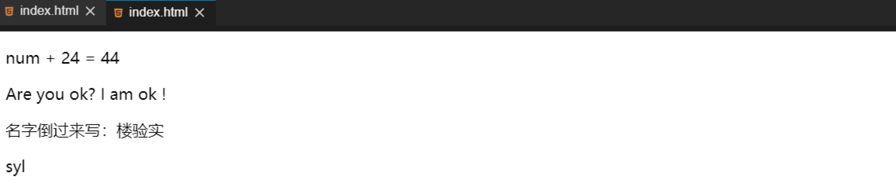

==== 指令

指令 (Directives) 是带有 v- 前缀的特殊特性。

===== 参数

一些指令能够接收一个“参数”，在指令名称之后以冒号表示。例如，v-bind 指令可以用于响应式地更新 HTML 特性，在这里 href 是参数，告知 v-bind 指令将该元素的 href 特性与表达式 url 的值绑定，例子：

[source,html,indent=0]
----
<!DOCTYPE html>
<html lang="en">
  <head>
    <meta charset="UTF-8" />
    <meta name="viewport" content="width=device-width, initial-scale=1.0" />
    <meta http-equiv="X-UA-Compatible" content="ie=edge" />
    <title>syl-vue</title>
    <!-- 通过cdn方式引入 vue.js -->
    
  </head>
  <body>
    <!-- 指令 参数-->
    

      <a v-bind:href="url">实验楼</a>
    

    
  </body>
</html>
----

另外一个例子，v-on 指令，用于监听 DOM 事件，例子：

[source,html,indent=0]
----
<!DOCTYPE html>
<html lang="en">
  <head>
    <meta charset="UTF-8" />
    <meta name="viewport" content="width=device-width, initial-scale=1.0" />
    <meta http-equiv="X-UA-Compatible" content="ie=edge" />
    <title>syl-vue</title>
    <!-- 通过cdn方式引入 vue.js -->
    
  </head>
  <body>
    <!-- 指令 参数-->
    

      
我叫：{{name}}

      <!-- handleClick 使我们在实例 methods 中写的方法 -->
      <button v-on:click="handleClick">点我</button>
    

    
  </body>
</html>
----

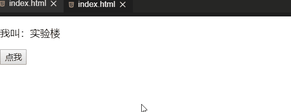

===== 动态参数

上面属性或者事件我们都是写死的，其实在 Vue 它也可以是动态的。

[source,html,indent=0]
----
<!DOCTYPE html>
<html lang="en">
  <head>
    <meta charset="UTF-8" />
    <meta name="viewport" content="width=device-width, initial-scale=1.0" />
    <meta http-equiv="X-UA-Compatible" content="ie=edge" />
    <title>syl-vue</title>
    <!-- 通过cdn方式引入 vue.js -->
    
  </head>
  <body>
    <!-- 指令 动态参数-->
    

      
我叫：{{name}}

      <button v-on:[event]="handleClick">点我</button>
    

    
  </body>
</html>
----

event 此时的值为 click ，那我们点击按钮时就会触发事件回调，运行结果和上面一样。

===== 修饰符

修饰符是以半角句号 . 指明的特殊后缀，用于指出一个指令应该以特殊方式绑定，大致分为三类，后面课程我们会一一接触到：

- 事件修饰符
- 按键修饰符
- 系统修饰符

例如，事件修饰符中的.prevent修饰符和原生 event.preventDefault() 效果一样，可以阻止事件默认行为，在表单中点击提交按钮，就会发生页面跳转，但是使用了 .prevent 就不会发生跳转，例如：

[source,html,indent=0]
----
<!DOCTYPE html>
<html lang="en">
  <head>
    <meta charset="UTF-8" />
    <meta name="viewport" content="width=device-width, initial-scale=1.0" />
    <meta http-equiv="X-UA-Compatible" content="ie=edge" />
    <title>syl-vue</title>
    <!-- 通过cdn方式引入 vue.js -->
    
  </head>
  <body>
    <!-- 指令 修饰符-->
    

      <form action="/" v-on:submit.prevent="submit">
        <button type="submit">提交</button>
      </form>
    

    
  </body>
</html>
----

没有加修饰符，发生默认跳转，运行效果：

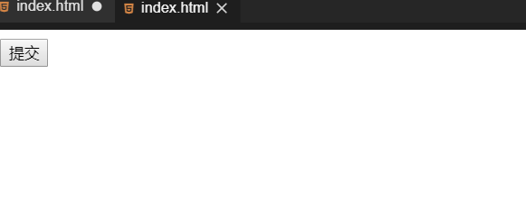

使用了 .prevent ，阻止了默认跳转，运行结果：

==== 指令缩写

v- 是 Vue.js 中特定的标志，用来识别模板中 Vue 特定的特性。当你在使用 Vue.js 为现有标签添加动态行为时，v- 前缀很有帮助，但是频繁使用到，也会让人感觉不到代码的简洁之道，就会感到不是太人性化。同时，在构建由 Vue 管理所有模板的单页面应用程序时，v- 前缀也变得没那么重要了。因此，Vue 为 v-bind 和 v-on 这两个最常用的指令，提供了特定简写。

===== v-bind

上面例子中我们使用了 v-bind 绑定属性

[source,html,indent=0]
----
<a v-bind:href="url">实验楼</a>
----

我们可以简写为：

[source,html,indent=0]
----
<a :href="url">实验楼</a>
----

同样的使用 v-bind 绑定的其他属性也可以简写：

[source,text,indent=0]
----
v-bind:class="className" 简写为 :class="className"
v-bind:value="myValue" 简写为 :value
----

===== v-on

上面 v-bind 指令提供简写，同样 v-on 指令也提供简写，但是与 v-bind 有一些差异，v-on: 使用 @ 简写。

[source,html,indent=0]
----
<!-- 完整语法 -->
<button v-on:click="handleClick">点我</button>
<!-- 缩写 -->
<button @click="handleClick">点我</button>
----

==== 总结

- 双大括号表达式
- 插值
- v-bind 指令
- v-on 指令
- 指令缩写

本小节让我们学习了 Vue.js 模板语法，了解双大括号表达式，以及模板插值，模板上简单的指令应用，指令的缩写模式等，相信大家对 Vue.js 已经有了初步了解，看看自己掌握没有，我们将进入更深入的学习。

== 计算属性、侦听属性与过滤器

=== 简介

前面课程中我们接触到了 Vue 实例选项中的 el、data、methods 这三个属性，还记得它们各自的用途吗？接下来我们将学习实例的其他属性。

*知识点*

- 计算属性
- 计算属性中 getter 和 setter
- 侦听属性
- 计算属性与侦听属性对比
- 过滤器的使用

=== 计算属性

在开发中经常会涉及到一种需求，一个数据需要通过其他数据计算而来。例如：购物车，平常开发数据与数据关联计算是非常麻烦的，而 Vue 中的计算属性可以轻松帮你解决，可以像绑定普通属性一样在模板中绑定计算属性，可以直接使用{{}}向页面输出。

==== 计算属性的基本使用

在实例的 computed 选项中定义你的计算属性，直接使用{{}}向页面输出。

[source,html,indent=0]
----
<!DOCTYPE html>
<html lang="en">
  <head>
    <meta charset="UTF-8" />
    <meta name="viewport" content="width=device-width, initial-scale=1.0" />
    <meta http-equiv="X-UA-Compatible" content="ie=edge" />
    <title>syl-vue-test</title>
    <!-- 引入 vue.js -->
    
  </head>
  <body>
    

      
我名字正着写：{{name}}

      <!-- reverseName 计算属性  可以像绑定普通属性一样在模板中绑定计算属性-->
      
计算出我名字倒着写：{{reverseName}}

    

    
  </body>
</html>
----

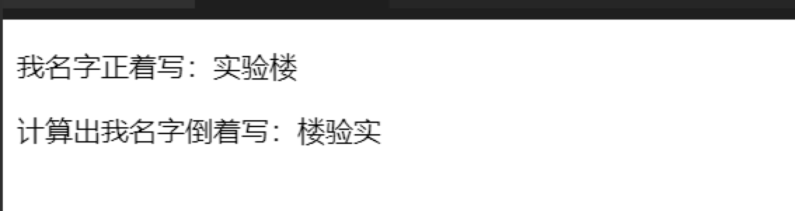

这里我们声明了一个计算属性 reverseName ，你可以像绑定普通属性一样在模板中绑定计算属性。当你的计算属性的依赖数据发生改变时，你的相关计算属性也会重新计算。上面通过计算属性轻松地实现出展示名字倒着写，你也快看看，你名字倒过来是什么！

重点：在 Vue 中计算属性是 惰性的，只有当依赖数据发生改变时，才会触发计算，否则，它的值是上一次触发计算的缓存值，下面例子很清楚说明，它是惰性的。

[source,html,indent=0]
----
<!DOCTYPE html>
<html lang="en">
  <head>
    <meta charset="UTF-8" />
    <meta name="viewport" content="width=device-width, initial-scale=1.0" />
    <meta http-equiv="X-UA-Compatible" content="ie=edge" />
    <title>syl-vue-test</title>
    <!-- 引入 vue.js -->
    
  </head>
  <body>
    
{{now}}

    
  </body>
</html>
----

在你的理解中界面会一直时间更新,其实我们定义的 now 并没有和实例中数据建立响应式依赖，只是依赖 Date 对象获取系统时间，它只会计算一次，然后将值缓存，要使得他改变只有 刷新 才能触发，运行结果：

==== 计算属性的setter和getter

计算属性的 setter 和 getter 是它的高级使用，上面的例子只使用到它的 getter 属性，通过其他数据计算而得，其实我们也可以，直接赋值，通过计算属性来改变依赖数据的值。

下面例子我们通过触发计算属性 setter，改变原本关联数据。

[source,html,indent=0]
----
<!DOCTYPE html>
<html lang="en">
  <head>
    <meta charset="UTF-8" />
    <meta name="viewport" content="width=device-width, initial-scale=1.0" />
    <meta http-equiv="X-UA-Compatible" content="ie=edge" />
    <title>syl-vue-test</title>
    <!-- 引入 vue.js -->
    
  </head>
  <body>
    

      
firstName:{{firstName}}

      
lastName:{{lastName}}

      
全名是:{{fullName}}

      <button v-on:click="changeName">改姓</button>
    

    
  </body>
</html>
----

=== 侦听属性

在开发我们需要监听数据的变化，Vue 提供了一种更通用的方式来观察和响应 Vue 实例上的数据变动，侦听属性。在实例 watch 选项中确定监听项。

下面这个例子，我们通过按钮点击改变 msg 的值，并且监听新旧值改变，并输出新旧值。

[source,html,indent=0]
----
<!DOCTYPE html>
<html lang="en">
  <head>
    <meta charset="UTF-8" />
    <meta name="viewport" content="width=device-width, initial-scale=1.0" />
    <meta http-equiv="X-UA-Compatible" content="ie=edge" />
    <title>syl-vue-test</title>
    <!-- 引入 vue.js -->
    
  </head>
  <body>
    

      
{{msg}}

      <!-- v-on:click 简写为 @click -->
      <button @click="handleClick('hello syl')">改变msg</button>
    

    
  </body>
</html>
----

计算属性与侦听属性对比

计算属性和侦听属性两者在很多场景都是共同，都可以实现同样的需求。

我们使用侦听属性，改写计算属性例子：

[source,html,indent=0]
----
<!DOCTYPE html>
<html lang="en">
  <head>
    <meta charset="UTF-8" />
    <meta name="viewport" content="width=device-width, initial-scale=1.0" />
    <meta http-equiv="X-UA-Compatible" content="ie=edge" />
    <title>syl-vue-test</title>
    <!-- 引入 vue.js -->
    
  </head>
  <body>
    

      
firstName:{{firstName}}

      
lastName:{{lastName}}

      
全名是:{{fullName}}

      <button v-on:click="changeName">改姓</button>
    

    
  </body>
</html>
----

效果是一样的，运行效果:

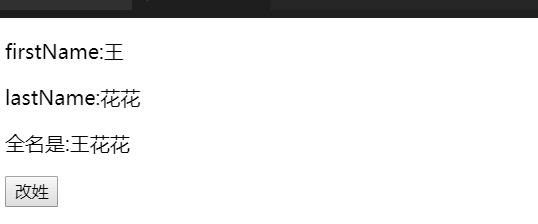

NOTE: 通常来说能用计算属性代替就用计算属性代替，大多情况计算属性代码更精简，可读性更高。

=== 过滤器

计算属性和侦听属性，在数据处理环节中很有作用，但是用它来处理数据过滤不是最优的，在 Vue 中我们有一个专门处理数据过滤的东西：过滤器。过滤器可以用在两个地方：双花括号插值和 v-bind 表达式 (后者从 2.1.0+ 开始支持)，用法示例：

[source,html,indent=0]
----

{{msg2|getString}}

----

==== 过滤器使用方法

在双花括号插值和 v-bind 表达式中把需要过滤的数据用 | 与过滤器分割 （data|fliter）

例子：

使用 filters 过滤器实现大写转换和自动去除字符串中的数字

[source,html,indent=0]
----
<!DOCTYPE html>
<html lang="en">
  <head>
    <meta charset="UTF-8" />
    <meta name="viewport" content="width=device-width, initial-scale=1.0" />
    <meta http-equiv="X-UA-Compatible" content="ie=edge" />
    <title>syl-vue-test</title>
    <!-- 引入 vue.js -->
    
  </head>
  <body>
    

      <!-- toUpperCase   getString  为自定义的过滤器-->
      
小写转换大写：过滤前：{{msg}} 过滤后： {{msg|toUpperCase}}

      
去除数字：过滤前：{{msg2}} 过滤后： {{msg2|getString}}

    

    
  </body>
</html>
----

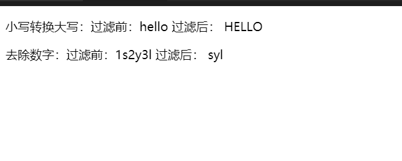

==== 过滤器应用场景

应用比较多的商品价格过滤、表单数据过滤等。

我们从后台获取的数据一般是这样

[source,json,indent=0]
----
{ "courseName":"xxx", "price":199, "coupon":8 }
----

我们请求到的数据并没有￥，在开发中直接去操作数据源是不推荐的，此时我们的过滤器就派上用场，定义一个拼接￥的过滤器，只是在视图层面实现了效果。

[source,html,indent=0]
----
<!DOCTYPE html>
<html lang="en">
  <head>
    <meta charset="UTF-8" />
    <meta name="viewport" content="width=device-width, initial-scale=1.0" />
    <meta http-equiv="X-UA-Compatible" content="ie=edge" />
    <title>syl-vue-test</title>
    <!-- 引入 vue.js -->
    
  </head>
  <body>
    

      <!-- joint  为自定义的过滤器-->
      
不要￥899，只要{{price|joint}}

    

    
  </body>
</html>
----

=== 综合小练习

综合计算属性和过滤器，实现一个简易的购物车：

[source,html,indent=0]
----
<!DOCTYPE html>
<html lang="en">
  <head>
    <meta charset="UTF-8" />
    <meta name="viewport" content="width=device-width, initial-scale=1.0" />
    <meta http-equiv="X-UA-Compatible" content="ie=edge" />
    <title>syl-vue-test</title>
    <!-- 引入 vue.js -->
    
    
  </head>
  <body>
    

      <!-- joint  为自定义的过滤器-->
      
单价{{price|joint}}

      数量：<input type="number" v-model="goodsNum" />
      
总价：{{allPrice|joint}}

    

    
  </body>
</html>
----

效果：

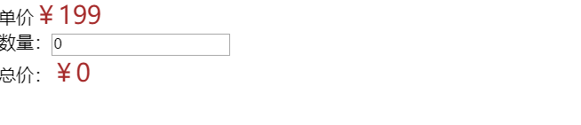

=== 总结

我们学习了 Vue 实例中其他选项

- 计算属性
- 计算属性中 getter 和 setter
- 侦听属性
- 计算属性与侦听属性对比
- 过滤器的使用

相信大家收获肯定不少，赶快检验自己有没有掌握。